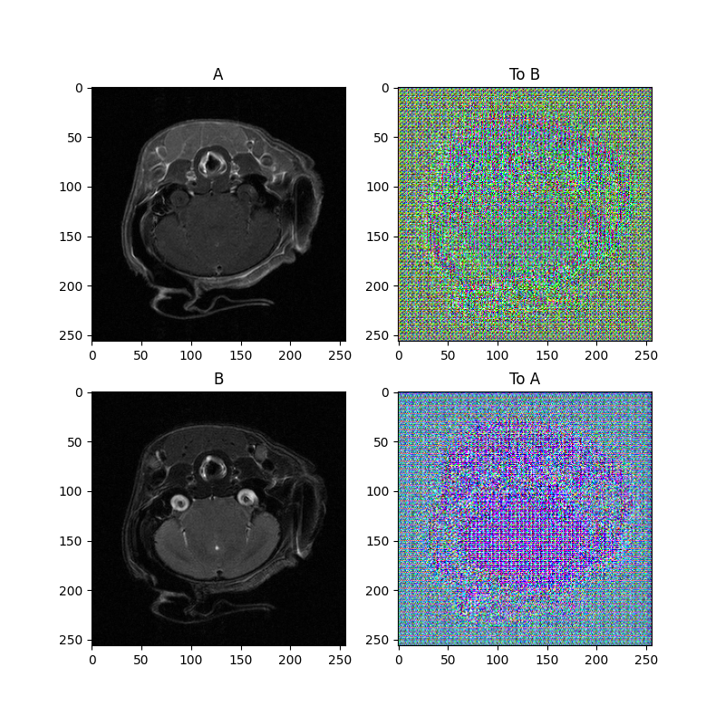

# CycleGAN for MRI brain images

This project creates synthetic mirror images for MRI brain on a murine brain model. In the CycleGAN_train.py we can find the code for training section and validation.

Looking at Figure1, the training part of the code works on 2 series of images: a T1 weighted image as TRAIN_A and a T2 weighted image as TRAIN_B. The method is trying to learn and implement a model to generate a synthetic T2 brain image given a T1 brain image. CycleGAN images and try to reproduce TRAIN_B images through a cycle GAN method. Here some of the images created during the process.

Figure 1: Train images. TRAIN_A represents the starting image while TRAIN_B represent the target image or the image we want to obtain. both set of data are feed to the train part of the code for training purposes.
.

 
The Generator and Discriminator are two active and essential parts of the training process. The Generator creates synthetic images, shown in Figure2 as maps, of both the starting and the potential target picture while the Discriminator is comparing the real images to the synthetic and discard the "fake" ones thus modifying to the weights of the model. The looping of the Generator and Discriminator is necessary to obtain an optimized model which can be then applied for validation and tests. Figure2 shows the Generator and Discriminator with some of the maps created by the two features during the training phase.

Figure2: Generator image on the left and Discriminator in the right.
. .
 

At last, the code create a validation assessment of the model in real time during the cycleGAN looping shown as starting image and the targeted synthetic. Figure3 reports the final image produced by the validation part. 

Figure3: Starting and targeted image generated at the end of the training by the validation phase.
.
 

The project was modified by the code proposed by the paper found in the paper folder:
Jun-Yan Zhu, Taesung Park, Phillip Isola, Alexei A. Efros  Unpaired Image-to-Image Translation using Cycle-Consistent Adversarial Networks.
